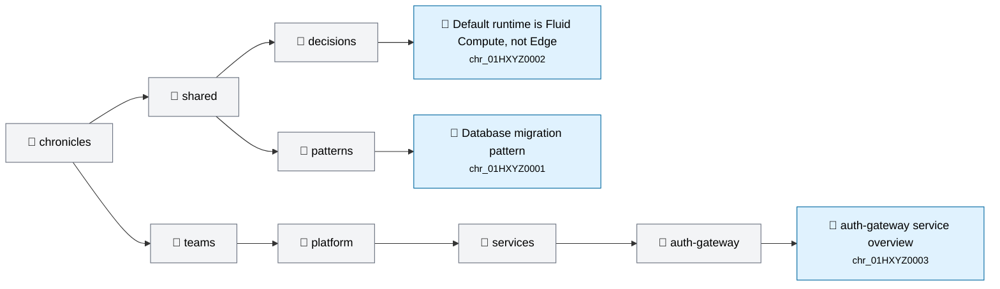

# team-chronicles-poc

Shared team knowledge base for Codex. Git-backed markdown + MCP retrieval + hooks for auto-sync, auto-consult, auto-promote.

## Layout

```
chronicles/        # source of truth, one dir per team, shared/ cross-team
  raw/             # drop sources here; ingest-source skill compiles into atoms
  shared/          # cross-team chronicles + index.md + log.md
  teams/<slug>/    # team-scoped chronicles + index.md + log.md
  private/         # access-controlled (security, compliance)
  projects/        # cross-cutting initiatives
plugin/            # chronicle-team Codex plugin (hooks + skills + MCP)
scripts/           # install + harvest + tree + index + PR-comment utilities
.github/workflows/ # CI: validate, regenerate README tree, comment on PRs
```

## Quick start

```bash
# 1. Codex hooks on
echo '[features]\ncodex_hooks = true' >> ~/.codex/config.toml

# 2. Install Node deps (root + MCP server)
npm install
cd plugin/mcp && npm install && cd ../..

# 3. Wire hooks + MCP into ~/.codex/
./scripts/install.sh

# 4. Set team (retrieval scope)
export CHRONICLE_TEAM=platform

# 5. Start codex in any repo
codex
```

## Flow

1. `SessionStart` hook: pulls latest chronicles, primes session
2. `UserPromptSubmit` hook: lexical retrieval injects relevant chronicles as `<team-chronicle>` blocks
3. `Stop` hook: harvester scans transcript, queues candidate chronicles
4. **Ingestion**: drop a doc in `chronicles/raw/`, invoke `/ingest-source`, get a draft PR
5. **Promotion**: in any session, `/promote-memory` queues a draft chronicle
6. **PR review**: PR auto-comments with a knowledge-tree diagram showing exactly where each new atom lands (highlighted)
7. **Merge**: GH Action regenerates the README tree + every `index.md`, commits to `main`
8. **Lint**: weekly `lint-chronicles` skill audits stale, orphan, contradictory atoms

## Skills

- `consult-chronicle` — explicit search when auto-retrieval missed
- `promote-memory` — convert session knowledge → draft chronicle
- `ingest-source` — compile a single raw doc → draft chronicle atoms
- `import-knowledge` — bulk import from Confluence / database / Notion / Drive / Slack export
- `lint-chronicles` — audit stale / orphan / contradictory entries

## Frontmatter

```yaml
---
id: chr_01HXYZ
type: decision|pattern|runbook|reference|fact|feedback|user|project
team: platform
scope: { teams: [], repos: [], paths: [] }   # empty = all
tags: [auth, migrations]
related: [chr_01HXYZ0002]                    # backlinks (optional)
supersedes: chr_01HXYZ0001                   # when replacing (optional)
confidence: high|medium|low
source: session|commit|doc|human|raw
created: 2026-04-24
updated: 2026-04-24
expires: 2026-10-24
---
```

## Knowledge tree

Auto-generated. Click any node in the diagram to open the chronicle.

<!-- chronicle-tree:start -->
### Knowledge tree



<details>
<summary>Markdown view</summary>

  - **shared/**
    - **decisions/**
      - [Default runtime is Fluid Compute, not Edge](chronicles/shared/decisions/why-fluid-compute.md) — `chr_01HXYZ0002` — decision — vercel, fluid-compute, edge, runtime
    - **patterns/**
      - [Database migration pattern](chronicles/shared/patterns/db-migrations.md) — `chr_01HXYZ0001` — pattern — db, migrations, postgres
  - **teams/**
    - **platform/**
      - **services/**
        - **auth-gateway/**
          - [auth-gateway service overview](chronicles/teams/platform/services/auth-gateway/overview.md) — `chr_01HXYZ0003` — reference — auth, service, jwt, session

</details>

<!-- chronicle-tree:end -->

## Status

POC. Lexical search only. Embedding upgrade tracked in `scripts/reindex.js` (stub). PR-time tree visualization + auto-README live.
